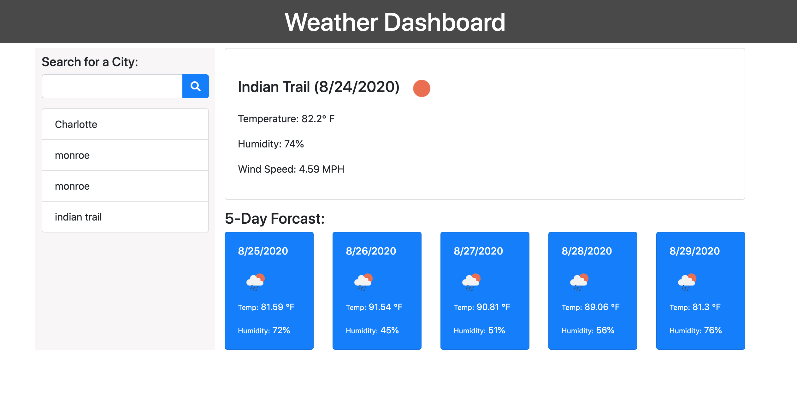

# 06 Server-Side APIs: Weather Dashboard

This application was made with HTML, CSS, JS and OpenWeather API and Moment.JS.

The purpose of this application is to determine a 5 day forecast for where you're located!

Any questions? You can reach me at victoriasmithh428@gmail.com

## Link to weather dashboard

[Click here to view](smith-weather-dashboard.netlify.app)

## Screenshot of dashboard

